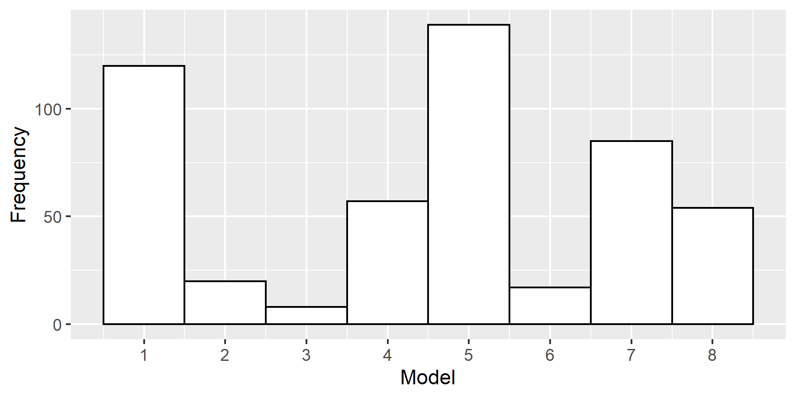
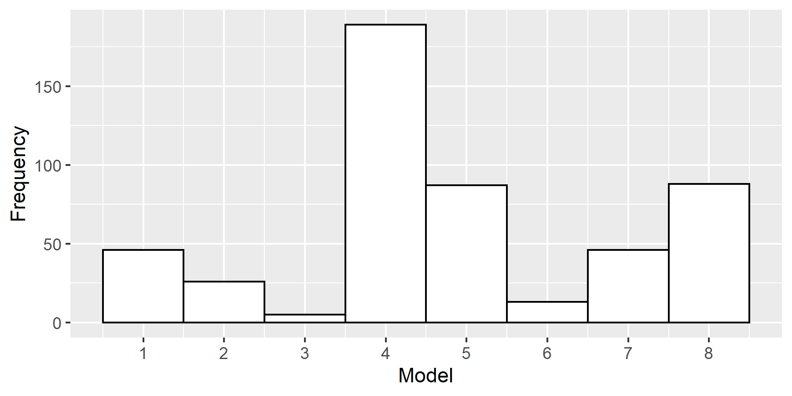
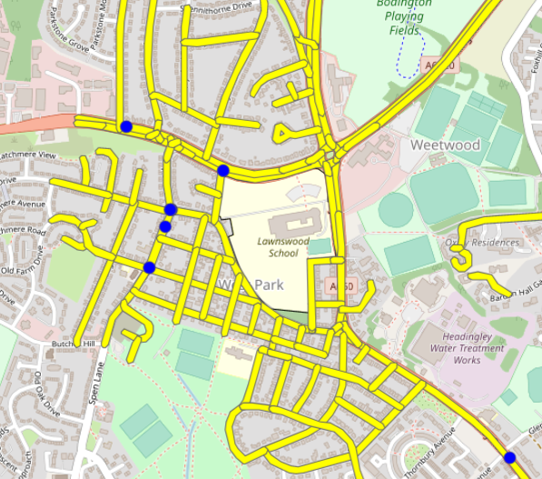

```{r setup, include=FALSE}
knitr::opts_chunk$set(include = FALSE, 
                      eval = FALSE, 
                      echo = FALSE,
                      fig.align="center", 
                      out.width="100%",
                      fig.pos="H") 

```

# 1. Introduction

Over the last decade, significant investments have been made by the United Kingdom (UK) Government to increase cycling and walking rates and improve road infrastructures for safety across the UK (cite). In 2017, the UK Government committed to make cycling and walking people's "natural choices for shorter journeys or parts of a longer journey" (cite). As the Government works towards realising this aim and more people take up walking or cycling as their primary modes of travel, it is imperative to concurrently address the issue of road safety, which is the central theme of this project. 

Addressing such transport problems using data science have been made possible with the increasing availability and accessibility of data in the transport industry and increasingly sophisticated analytical and modelling techniques. Its core advantage over traditional methods of solving transport problems is that the research methodologies and findings are more easily reproducible, and this strengthens the credibility and legitimacy of the research. 

In this project, we will be applying transport data science techniques to analyse road safety data for Leeds, United Kingdom (UK). The focus will be on pedestrian and cyclists, two of the road user group which are most susceptible to sustaining serious or even fatal injuries in accidents. Any efforts to address their safety on the roads will thus help save lives. In addition, such efforts will also help create a safer environment and alleviate fears of being victims to road accidents, which may otherwise be a barrier to adopting active modes of travel. Ultimately, it is hoped that the findings from this project can support the UK Government's ambitions in promoting active travel, with safety as the top priority. The analysis underlying this research is reproducible, based on code stored at...

## 1.1 Area of Study

Leeds is situated in the West Yorkshire county of England, occupying 551.7 square kilometres of land area. It has a population size of close to 800,000 (cite ONS) and a population density of about 1,450 residents per square kilometres. Leeds is divided into 107 Middle Layer Super Output Areas (MSOAs), which are further divided into 482 Lower Layer Super Output Areas (LSOAs). Each LSOA has an average population size of about 1,600.

In terms of transportation, Leeds is well-connected by air, rail and roads. It is accessible by several major motorways such as the M1 and A62. Congestion is a major problem in Leeds; Leeds was ranked 9th in the UK’s most congested urban areas in 2018 (cite). On the road safety front, pedestrians and cyclists were over-represented in accidents in Leeds. Based on the 2011 census, 15.6% of the surveyed population walk to work, but only 2.3% cycle (cite). However, pedestrians and cyclists respectively accounted for 19.0% and 16.9% of more than 9,000 accident casualties between 2014 and 2018.

## 1.1 Scope

This report analyses road safety of pedestrians and cyclists in Leeds in terms of four categories: who, when, where and how. We will first articulate the methodologies used in understanding, preparing, cleaning and visualising the data as part of exploratory data analysis (EDA) in Section 2. In Sections 3 to 6, we will perform the analyses in each of the four categories and discuss the results. In Section 7, we will propose policy recommendations to improve road safety for pedestrians and cyclists. We will discuss limitations of our analyses in Section 8 before proposing areas for future research in Section 9. All analyses underlying this report were performed using the R statistical software and are reproducible using the code available at . . .

```{r, message=FALSE, eval=FALSE, include=FALSE}
# install.packages("remotes")
# remotes::install_github("itsleeds/pct")
# remotes::install_github("itsleeds/geofabrik")
# remotes::install_github("ropensci/stats19")
# webshot::install_phantomjs()
```

# 2. Datasets

We will be using accidents and casualties data from the `stats19` package for the years 2014 to 2018. This five-year period was chosen as it was deemed sufficient to produce meaningful, relevant and current insights. In analysing geospatial distribution of accidents, we will be using Leeds’ highway data from the `osmdata` package. We will also be using origin-destination data of Leeds from the `pct` package to derive walking and cycling rates in Leeds. The datasets required in this report are also available at . . .

```{r load_packages, eval=TRUE, message=FALSE, warning=FALSE}

library(pct)
library(sf)
library(stplanr)
library(tidyverse)
library(tmap)
library(stats19)
library(lubridate)
library(gridExtra)
library(readxl)
library(knitr)
library(zoo)
library(dplyr)
library(plyr)
library(osmdata)
library(ggplot2)
library(gt)
library(randomForest)
library(ModelMetrics)

```


```{r #load_raw_data_from_web}

# Extract 2014 accidents and casualties data from stats19 package
raw_ac_2014 = stats19::get_stats19(year = 2014, type = "ac")
#write_csv(raw_ac_2014, "raw_ac_2014.csv") # Save as .csv file to read in locally later
raw_cas_2014 = stats19::get_stats19(year = 2014, type = "cas")
#write_csv(raw_cas_2014, "raw_cas_2014.csv") # Save as .csv file to read in locally later

# Extract 2015 accidents and casualties data from stats19 package
raw_ac_2015 = stats19::get_stats19(year = 2015, type = "ac")
#write_csv(raw_ac_2015, "raw_ac_2015.csv") # Save as .csv file to read in locally later
raw_cas_2015 = stats19::get_stats19(year = 2015, type = "cas")
#write_csv(raw_cas_2015, "raw_cas_2015.csv") # Save as .csv file to read in locally later

# Extract 2016 accidents and casualties data from stats19 package
raw_ac_2016 = stats19::get_stats19(year = 2016, type = "ac")
#write_csv(raw_ac_2016, "raw_ac_2016.csv") # Save as .csv file to read in locally later
raw_cas_2016 = stats19::get_stats19(year = 2016, type = "cas")
#write_csv(raw_cas_2016, "raw_cas_2016.csv") # Save as .csv file to read in locally later

# Extract 2017 accidents and casualties data from stats19 package
raw_ac_2017 = stats19::get_stats19(year = 2017, type = "ac")
#write_csv(raw_ac_2017, "raw_ac_2017.csv") # Save as .csv file to read in locally later
raw_cas_2017 = stats19::get_stats19(year = 2017, type = "cas")
#write_csv(raw_cas_2017, "raw_cas_2017.csv") # Save as .csv file to read in locally later

# Extract 2018 accidents and casualties data from stats19 package
raw_ac_2018 = stats19::get_stats19(year = 2018, type = "ac")
#write_csv(raw_ac_2018, "raw_ac_2018.csv") # Save as .csv file to read in locally later
raw_cas_2018 = stats19::get_stats19(year = 2018, type = "cas")
#write_csv(raw_cas_2018, "raw_cas_2018.csv") # Save as .csv file to read in locally later

```

```{r #load_raw_data_from_csv}

years <- seq(from = 2014, to = 2018)
data_type <- c("ac", "cas")

# For loop to read in csv files and create dataframes
for (i in 1:length(years)){
  for (j in 1:2){
    df_name = paste0("raw_", data_type[j], "_", years[i])
    assign(df_name, read.csv(paste0("Data/", df_name, ".csv"), stringsAsFactors = FALSE)) 
  }
}

```

# 3. Data Understanding

Before analysing the data, it was important to first understand the contents of the raw datasets before pre-processing them into forms suitable for subsequent analyses. This section will explain these stages in the context of the raw accident and casualties data from the `stats19` package.

## 3.1 Understanding the Raw Datasets

A useful way to understand the raw datasets was to first look at the column headings. The `stats19_variables` function provided brief descriptions of the variables. Since these raw datasets would later be concatenated, it was important that their column names matched. We found that for the raw accidents datasets, the names of all of the 33 columns matched. However, for the raw casualties datasets, it was found that the 2014 dataset contained 15 variables, but the rest contained 16. The missing variable was `casualty_imd_decile`, which could have been recorded only from 2015 onwards.

In addition, we used the `str()` function to determine the classes of each variable as well as their values. Doing so allowed us to identify variables which required conversion of classes. For example, the variable `accident_severity` was of `character` class, but given that it is a catagorical variable, it had to be converted to the `factor` class.

```{r #eda1}

# Access the metadata
stats19_variables

# Checking if the column names match
colnames(raw_ac_2014) == colnames(raw_ac_2018) # Example
colnames(raw_cas_2014) == colnames(raw_cas_2018) # Example (throws an error)

# Obtain a summary of the dataset (class and values)
str(raw_ac_2014)

```

## 3.2 Data Preparation 

Having gained an understanding of the datasets, the next step was to prepare them for our analyses. We filtered records for Leeds using the `filter()` function. For each year, we used the `left_join()` function to join the raw accident data to the raw casualties data, using accident index as the joining key. Next, we concatenated the datasets for the individual years into a main dataframe using the `bind_rows()` function.

Data cleaning is also an important part of data preparation. The raw datasets from the `stats19` package had been cleaned and formatted to a large extent. Notwithstanding, we found that a minority of the variables contained missing data. One of them was the variable `time`, which had five `NA` values. These missing values were imputed with the median^[Median was chosen over mean as it is typically less sensitive to outliers.] of the non-missing values1. The variable `lsoa_of_accident_location` was also found to have 58 `NA` values. Using `tmap` and the LSOA boundaries data, we manually inspected accident locations corresponding to each missing value and assigned the nearest LSOA to each missing value.


```{r #df_total_ac_leeds}

# Create a dataframe for accidents and casualties in Leeds in 2014
df_leeds_ac_2014 = 
  raw_ac_2014 %>% # Start with total number of accidents in 2014
  filter(local_authority_district == "Leeds") %>% # Filter out accidents in Leeds
  left_join(raw_cas_2014, by = c("accident_index" = "accident_index")) # Do a left join with the 2014 casualties data

# Create a dataframe for accidents and casualties in Leeds in 2015
df_leeds_ac_2015 = 
  raw_ac_2015 %>% # Start with total number of accidents in 2015
  filter(local_authority_district == "Leeds") %>% # Filter out accidents in Leeds
  left_join(raw_cas_2015, by = c("accident_index" = "accident_index")) # Do a left join with the 2015 casualties data

# Create a dataframe for accidents and casualties in Leeds in 2016
df_leeds_ac_2016 = 
  raw_ac_2016 %>% # Start with total number of accidents in 2016
  filter(local_authority_district == "Leeds") %>% # Filter out accidents in Leeds
  left_join(raw_cas_2016, by = c("accident_index" = "accident_index")) # Do a left join with the 2016 casualties data

# Create a dataframe for accidents and casualties in Leeds in 2017
df_leeds_ac_2017 = 
  raw_ac_2017 %>% # Start with total number of accidents in 2017
  filter(local_authority_district == "Leeds") %>% # Filter out accidents in Leeds
  left_join(raw_cas_2017, by = c("accident_index" = "accident_index")) # Do a left join with the 2017 casualties data

# Create a dataframe for accidents and casualties in Leeds in 2018
df_leeds_ac_2018 = 
  raw_ac_2018 %>% # Start with total number of accidents in 2018
  filter(local_authority_district == "Leeds") %>% # Filter out accidents in Leeds
  left_join(raw_cas_2018, by = c("accident_index" = "accident_index")) # Do a left join with the 2018 casualties data
  
# Concatenate all dataframes to create a new data frame to store accident and casualties data in Leeds from 2014 to 2018
df_total_ac_leeds = bind_rows(df_leeds_ac_2014, 
                              df_leeds_ac_2015, 
                              df_leeds_ac_2016,
                              df_leeds_ac_2017,
                              df_leeds_ac_2018)

```

It was assessed that preserving the accident records of these missing values would ensure that the analyses were more thorough. In other instances, alternative methods of dealing with missing values include deletion, imputation with mean and replacement with zero values. Apart from checking for missing data, another key step is to check for possible outliers, which can be due to human errors in data recording and therefore need to be removed. One common method of identifying outliers is to visualise the data using boxplots.

```{r #pre_process_1}

### 1. LOCATE MISSING VALUES ###

DataExplorer::plot_missing(df_total_ac_leeds)
colSums(is.na(df_total_ac_leeds)) 
rowSums(is.na(df_total_ac_leeds)) 

```

```{r #pre-process_2}

### 2. MISSING VALUES IN 'TIME' COLUMN  ###

# There are 5 NAs in the column 'time'. 
df_total_ac_leeds %>% 
  filter(is.na(time)) %>% 
  nrow() # Output: 5

# Determine the median time of accident (in hours) for non-missing records
df_total_ac_leeds %>% 
  filter(!is.na(time)) %>% 
  mutate(year = year(date),
         time_hour = hour(hm(time))) %>% 
  group_by(year) %>% 
  summarise(median(time_hour))

# The median time of accidents (in hours) is the 15th hour, or 3.00-4.00pm. Therefore, it would be reasonable to impute the 5 missing NAs with 15 as the time of hour.
df_total_ac_leeds <-
  df_total_ac_leeds %>% # Start with the main dataframe
  replace_na(list(time = "15:00")) # Replace the NA values with median time

# Sanity check
df_total_ac_leeds %>% 
  filter(is.na(time)) %>% 
  nrow # Output: 0

```


```{r #pre-process_3}

### 3. MISSING VALUES IN 'LSOA_OF_ACCIDENT_LOCATION' COLUMN  ###

# There are 58 NAs in the column 'lsoa_of_accident_location'. 
df_total_ac_leeds %>% 
  filter(is.na(lsoa_of_accident_location)) %>% 
  nrow() # Output: 58

# Plot these 58 accident location and lsoa boundaries data.
missing_lsoa <- 
  df_total_ac_leeds %>% 
  filter(is.na(lsoa_of_accident_location)) %>% 
  format_sf()

# lsoa_boundaries = st_read("Data/england_lsoa_ru_classn_2011.shp")
# 
# tmap_mode("view")
# tm_shape(lsoa_boundaries) + 
#   tm_polygons(alpha=0.3) +
#   tm_shape(missing_lsoa) + 
#   tm_dots(size=0.2)

# Manually extract the accident index of these 58 locations...
a1 <- c("20141316H1029", "20151328E1461", "2014130018623", "20171346E0216",
        "2014130030345", "2014131830367", "20141318V0571", "20151325L0873",
        "20141312I0039", "2014130048209", "2014130043327", "20171349E0197",
        "2014130001153", "20171343E0213", "20171341E0023", "20141318G0660",
        "2014130004811", "20151328D1274", "20151327M1604", "20141317L1112",
        "2014131351484", "20171342E0246", "20151326R0374", "20141317O1333",
        "20141312H1210", "2014130008934", "2014131590760", "2015132860986",
        "20151321A0339", "2014130047033", "2014130050974", "2014130033332",
        "2014130035786", "2014131770761", "20171343E0234", "2014131730978",
        "2014130034085", "2014131BH1330", "2015132AI0812", "2014130007139",
        "2014130055061", "2015132CQ0615")

# ... and assign it to a LSOA
a2 <- c("E01011578", "E01011580", "E01011457", "E01011465", "E01011462", "E01011687",
        "E01011381", "E01011381", "E01011558", "E01011718", "E01011407", "E01011296",
        "E01011396", "E01011302", "E01011411", "E01011628", "E01032495", "E01011468",
        "E01011368", "E01011523", "E01032503", "E01011610", "E01011738", "E01011529",
        "E01011366", "E01011677", "E01011677", "E01011293", "E01011481", "E01033005",
        "E01011446", "E01011443", "E01032946", "E01011415", "E01011423", "E01011430",
        "E01011430", "E01011422", "E01011435", "E01033006", "E01011422", "E01011427")

# Create a dataframe
missing_df <- 
  data.frame(accident_index=a1, lsoa_of_accident_location=a2) %>% # Create a dataframe
  mutate(accident_index = as.character(accident_index)) %>% # Convert to character class
  mutate(lsoa_of_accident_location = as.character(lsoa_of_accident_location)) # Convert to character class  

# Create a subset of original dataframe for records with missing LSOA and fill them with the assigned LSOA
df_total_ac_leeds_missing <- 
df_total_ac_leeds %>% 
  filter(is.na(lsoa_of_accident_location)) %>% # Filter records where LSOA is missing
  left_join(missing_df, by = "accident_index") %>% # Join these records with missing_df
  mutate(lsoa_of_accident_location.x = lsoa_of_accident_location.y) %>% # Fill missing LSOA with assigned LSOA codes 
  select(-lsoa_of_accident_location.y) %>% # Remove this column
  dplyr::rename(lsoa_of_accident_location = lsoa_of_accident_location.x)
  
# Combine with original dataframe 
df_total_ac_leeds <-
  df_total_ac_leeds %>% 
  filter(!is.na(lsoa_of_accident_location)) %>% # Filter records where LSOA is not missing
  bind_rows(df_total_ac_leeds_missing) # Concatenate with dataframe for the 58 records

# Sanity check
df_total_ac_leeds %>% 
  filter(is.na(lsoa_of_accident_location)) %>% 
  nrow # Output: 0

```

```{r #pre-process_4}

### 4. EXTRACT YEAR, MONTH, DAY, TIME AND HOUR ### 

df_total_ac_leeds <-
df_total_ac_leeds %>% 
  mutate(year = year(date), # Extract the year from the 'date' column  
         month = month(date, label = TRUE), # Extract the month from the 'date' column
         day = day(date), # Extract the day from the 'date' column
         time_hour = hour(hm(time)), # Extract the hour from the 'time' column
         time_minute = minute(hm(time))) %>% # Extract the minute from the 'time' column
  group_by(year, month, day, time_hour, time_minute) %>% # Group the accidents in chronological order
  arrange(year, month, day, time_hour, time_minute) # Arrange the accidents in chronological order 

```

```{r #pre-process_5}

### 5. SELECT DESIRED COLUMNS ###

# Define desired columns
desired_cols <- c("accident_index", "date", "year", "month", "day", 
                  "time", "time_hour", "time_minute", "day_of_week",
                  "accident_severity", "number_of_casualties", 
                  "casualty_severity", "casualty_type", "casualty_class",
                  "sex_of_casualty", "age_of_casualty", "first_road_class",
                  "road_type", "speed_limit", "second_road_class", 
                  "pedestrian_location", "pedestrian_movement",
                  "location_easting_osgr", "location_northing_osgr", 
                  "lsoa_of_accident_location", "number_of_vehicles",
                  "first_road_class", "road_type", 
                  "speed_limit", "junction_detail", "light_conditions",
                  "weather_conditions", "road_surface_conditions")

df_total_ac_leeds <-
df_total_ac_leeds %>% 
  select(all_of(desired_cols))

```


```{r #pre-process_6}

### 6. REGROUP CASUALTY TYPES ###

cas_type <- unique(df_total_ac_leeds$casualty_type)

df_total_ac_leeds <-
df_total_ac_leeds %>% # Start with the main dataframe
  mutate(cas_type = case_when(casualty_type %in% c(cas_type[1], cas_type[3]) ~ "Car occupant",
                              casualty_type %in% c(cas_type[2]) ~ "Pedestrian",
                              casualty_type %in% c(cas_type[4], cas_type[8], cas_type[9], 
                                                   cas_type[11], cas_type[18]) ~ "Motorcyclist and pillion",
                              casualty_type %in% c(cas_type[5]) ~ "Cyclist", 
                              casualty_type %in% c(cas_type[7], cas_type[10], cas_type[12], 
                                                   cas_type[6], cas_type[16]) ~ "Bus and goods vehicle occupant",
                              casualty_type %in% c(cas_type[13], cas_type[15], cas_type[14], 
                                                   cas_type[17]) ~ "Others")) %>% # Reassign labels
  mutate(cas_type = factor(cas_type, levels = c("Pedestrian", "Cyclist", "Motorcyclist and pillion",
                                                "Car occupant", "Bus and goods vehicle occupant", "Others"))) # Convert cas_type to factor class and specify the levels

```

```{r #pre-process_7}

### 7. CLASS CONVERSION ###

df_total_ac_leeds <-
df_total_ac_leeds %>% 
  mutate(day_of_week = factor(day_of_week, 
                              levels = c("Sunday", "Monday", "Tuesday", "Wednesday", 
                                         "Thursday", "Friday", "Saturday"))) %>% 
  mutate(accident_severity = factor(accident_severity, 
                                    levels = c("Slight", "Serious", "Fatal"))) %>% 
  mutate(casualty_severity = factor(casualty_severity, 
                                    levels = c("Slight", "Serious", "Fatal"))) %>% 
  mutate(sex_of_casualty = factor(sex_of_casualty,
                                  levels = c("Female", "Male"))) 


```

```{r #df_total_ac_leeds_cleaned}

# Out of 11943 records, there are many which correspond to the same accident event. 

# Create a dataframe with distinct accidents
df_total_ac_leeds_cleaned = 
df_total_ac_leeds %>% # Start with the main dataframe 
  distinct(accident_index, .keep_all = TRUE) # Only keep records of distinct accidents

```

```{r #write_as_csv}

# Finally, write the cleaned dataset into a .csv file.
write.csv(df_total_ac_leeds, "Data/df_total_ac_leeds.csv")
write.csv(df_total_ac_leeds_cleaned, "Data/df_total_ac_leeds_cleaned.csv")

```

Out of 48 variables, 28 were selected for subsequent analyses. We used functions in the lubridate package to extract the year, month and day from the date variable. As some variables were categorical but of the character class, they were converted to the factor class. There were originally 21 unique types of casualties in the dataset, but since our analyses would not require such fine-grained details, they were recategorised into six main groups. There were also multiple records corresponding to a single accident event, possibly due to accidents with multiple casualties. These duplicates were filtered out.    
```{r load_df_total_ac_leeds_cleaned, eval=TRUE}

df_total_ac_leeds <- 
  read.csv("Data/df_total_ac_leeds.csv") %>% 
  select(-X)

df_total_ac_leeds_cleaned <- 
  read.csv("Data/df_total_ac_leeds_cleaned.csv") %>% 
  select(-X)

```

## 3.3 Exploratory Data Analysis

A key part of the EDA is to extract summary statistics and general trends from the dataset. We used the `summary()` function to obtain a summary of numerical variables, such as `age_of_casualty` and `number_of_vehicles`. We plotted a time-series graph, shown in Figure 1, to understand the trend of monthly number of accidents in Leeds from 2014 to 2018. To some extent, there was a seasonal pattern to the occurrences of accidents in Leeds during this period. The number of accidents typically increased at the beginning of the year, fluctuated over the next few months, and decreased towards the end of the year. 
  
```{r #eda2}

summary(df_total_ac_leeds_cleaned)

```

```{r #figure_1}

(figure_1 <-
  df_total_ac_leeds %>% 
  mutate(month_year = zoo::as.yearmon(date)) %>% 
  group_by(month_year) %>% 
  dplyr::summarise(count = n()) %>% 
  ggplot(aes(x = month_year, y = count)) +
  geom_line(colour = "steelblue", lwd = 0.9) +
  geom_point() +
  labs(x = "Year", 
       y = "Number of Accidents") +
  ylim(c(140, 280)))

figure_1 + ggsave("Figures/Figure_1.png", width = 6, height = 4)

```

```{r display_figure_1, fig.cap="Time Series of Monthly Number of Accidents in Leeds, 2014-2018", eval=TRUE, echo=FALSE, include=TRUE, out.width="50%"}

include_graphics("Figures/Figure_1.png")

```

```{r #figure_2a}

# Bar chart showing total number of accidents in Leeds between 2014 and 2018
(figure_2a <-
df_total_ac_leeds_cleaned %>% 
  group_by(year) %>% 
  dplyr::summarise(count = n()) %>% 
  ggplot(aes(x = year, y = count, fill = year)) +
  geom_col(show.legend = FALSE, width = 0.6) +
  scale_color_discrete(palette = "Paired") +
  labs(x = "Year", y = "Number of Accidents") + 
  geom_text(aes(label = count), vjust=-0.30, size=3)) 

figure_2a + ggsave("Figures/Figure_2a.png", width = 6, height = 4)

```

```{r #figure_2b}

# Bar chart showing total number of casualties in Leeds between 2014 and 2018
(figure_2b <- 
df_total_ac_leeds %>% 
  group_by(year) %>% 
  dplyr::summarise(count = n()) %>% 
  ggplot(aes(x = year, y = count, fill = year)) +
  geom_col(show.legend = FALSE, width = 0.6) +
  scale_color_discrete(palette = "Paired") +
  labs(x = "Year", y = "Number of Casualties") + 
  geom_text(aes(label = count), vjust=-0.30, size=3))

figure_2b + ggsave("Figures/Figure_2b.png", width = 6, height = 4)

```

```{r #save_figure_2a_and_2b}

grid.arrange(figure_2a, figure_2b, nrow = 1, ncol = 2)

ggsave("Figures/Figure_2.png", 
       arrangeGrob(figure_2a, figure_2b, nrow = 1, ncol = 2),
       width = 12, height = 4)

```

```{r display_figure_2, eval=TRUE, echo=FALSE, include=TRUE, fig.cap="Number of accidents (left) and casualties (right) in Leeds, 2014-2018"}

include_graphics("Figures/Figure_2.png")

```

Figure 2 shows the overall numbers of accidents and casualties from 2014 to 2018. Both sub-figures follow similar trends but the casualty numbers were higher than accident counts plausibly because of accidents with multiple casualties. From Figure 2, it appeared that the roads in Leeds are becoming safer, with steady
declines in the numbers of accidents and casualties since 2015. 2018 saw 25% less accidents than 2015. A breakdown by severity of accidents reveals further insights, as shown in Figure 3. The decline in overall accident numnbers since 2015, as we saw in Figure 2, was mainly contributed by decreases in slight accidents, and to a lesser extent, serious accidents. Fatal accidents, however, had been increasing since 2016.

```{r #figure_3}
 
# Breakdown of each year by accident severity
(figure_3 <-
  df_total_ac_leeds_cleaned %>% 
  mutate(accident_severity = factor(accident_severity, 
                                    levels = c("Slight", "Serious", "Fatal"))) %>% 
  group_by(year, accident_severity) %>% 
  dplyr::summarise(count = n()) %>%
  ggplot(aes(x = year,
             y = count, 
             fill = accident_severity)) +
  geom_bar(stat = "identity", 
           position = "dodge", 
           alpha = 0.6,
           show.legend = FALSE, width = 0.5) + 
  facet_wrap(~accident_severity) +
  scale_fill_manual(values = c("Blue", "Orange", "Red")) +
  labs(x = "Year", 
       y = "Number of Accidents") +
  geom_text(aes(label = count), vjust=-0.35, size=3))

figure_3 + ggsave("Figures/Figure_3.png", width = 6, height = 4)

```

```{r display_figure_3, eval=TRUE, echo=FALSE, include=TRUE, fig.cap="Number of accidents in Leeds by severity, 2014-2018", out.width="50%"}

include_graphics("Figures/Figure_3.png")

```

# 4. The 'Who': Profile of Accident Casualties

Having pre-processed the data and performed EDA, we will analyse it to gain insights on accidents involving pedestrians and cyclists. The focus of this section is answering the question, "Who were at risk of accidents?" by understanding the profiles of accident casualties based on past data. 

## 4.1 Methodology

Limited demographic information about accident victims was available in the dataset, presumably due to the need to protect their privacy. The only demographic information available were age and gender, with which we plotted histograms and boxplots. Histograms provide useful insights into the distributions of casualties by age and gender, whereas boxplots allow us to graphically visualise the median and spread of the data. These plots are shown in Figure 4.

## 4.2 Results and Discussions

```{r #figure_4a}

(figure_4a <- 
df_total_ac_leeds %>% 
  filter(cas_type == "Pedestrian" | cas_type == "Cyclist")%>% 
  ggplot(aes(x = age_of_casualty, fill = sex_of_casualty)) +
  geom_histogram(alpha=0.5, binwidth = 2,
                 position = 'identity') +
  xlab("Age of Casualty") +
  ylab("Number of Casualties") +
  facet_grid(cols = vars(cas_type), scales = "free_y") +
  theme(legend.position = "bottom", 
        legend.title = element_blank()))

figure_4a + ggsave("Figures/Figure_4a.png", width = 6, height = 4)

```

```{r #figure_4b}

(figure_4b <- 
df_total_ac_leeds %>% 
  filter(cas_type == "Pedestrian" | cas_type == "Cyclist") %>%
  ggplot(aes(x = sex_of_casualty, y = age_of_casualty, fill = sex_of_casualty)) +
  geom_boxplot(alpha = 0.6) + 
#  geom_dotplot(binaxis = 'y', stackdir = 'center', dotsize = 0.5, fill = "red") +
  xlab("Sex of Casualty") +
  ylab("Age of Casualties") +
  facet_grid(cols = vars(cas_type), scales = "free_y") +
  theme(legend.position = "bottom", 
        legend.title = element_blank()))

figure_4b + ggsave("Figures/Figure_4b.png", width = 6, height = 4)

```

```{r #save_figure_4a_and_4b}

grid.arrange(figure_4a, figure_4b, nrow = 1, ncol = 2)

ggsave("Figures/Figure_4.png", 
       arrangeGrob(figure_4a, figure_4b, nrow = 1, ncol = 2),
       width = 12, height = 4)

```

```{r display_figure_4, eval=TRUE, echo=FALSE, include=TRUE, fig.cap="Graphical summaries of profiles of pedestrian and cyclist casualties"}

include_graphics("Figures/Figure_4.png")

```

Several useful insights can be extracted from Figure 4. For cyclists, there were significantly more male casualties than female. The distribution of male cyclist casualties appeared to be bimodal, that is, having two peaks---one at around 24 years old and another at around 40. The former could be attributed to male student population at the universities who cycle to school, whereas the latter could be more mature male adults who cycle to work, or cycle for competitive or recreational purposes. The peak age for female cyclist casualties was less apparent, although it seemed to be around mid-20s. One similarity between male and female cyclist casualties was that their age distributions tapered off at 75. 

Unlike cyclist casualties, pedestrian casualties had more equal distribution between the genders. The age distributions for male and female pedestrian casualties were both positively skewed, with peaks at 12 and 14 years old respectively. These could be mainly high school students who get into accidents during their journeys either to or from schools. The histogram for pedestrians shows that the age distribution only tapered off in the late-80s or 90s, implying that many elderly were susceptible to accidents as pedestrians. 

The boxplots show that pedestrian casualties were of lower median ages than cyclist casualties but they had higher IQR, meaning that the range of age of casualties was wider. This could also be observed from the histograms. For cyclist casualties, the median age of male casualties, shown by the middle black line of the box, was slightly higher than that of female casualties, although the spread of age measured by the inter-quartile range (IQR)^[The IQR is the difference between the upper quartile and lower quartile and represents the middle 50% of data. In boxplots, it is indicated by the height of the box.] were roughly similar. The converse is true for pedestrian casualties---female casualties were of a slightly higher median age than male. 

# 5. The 'When': Temporal Distribution of Accidents

Although accidents are random events in space and time, it is possible to extract temporal patterns with enough data. This will be the focus of this section. Specifically, we will seek to address the question, "When were accidents most likely to occur?" 

## 5.1 Methodology

To aid us in uncovering temporal patterns, we visualised the data using heatmaps. Heatmaps are generally useful in visualising relative volumes of events within a dataset. Their effectiveness stems from the ability to draw the viewer's attention to specific trends and areas of interest through the use of colours and shades. 

We created two heatmaps---one for number of casualties by months, and another for number of casualties by hour of a day. Before creating them, the data first needed to be in the correct form. For instance, it was necessary to specify the levels of the variables `day_of_week` and `month` to ensure the correct sequence of months and days in the resulting heatmaps. The `geom_tile()` function was used together with `facet_grid()` and `facet_wrap()` to display the heatmaps for pedestrian and cyclist accidents together. 

## 5.2 Results and Discussions

The resulting heatmaps are shown in Figures 5 and 6. These heatmaps are extremely insightful in this analysis because they communicate the most accident-prone times for pedestrians and cyclists effectively using the darker shades. Figure 5 shows that there were more pedestrian casualties in the months of November, December and January than other months. The weather is typically more wet and harsh during these winter months and the roads more slippery. These factors could have affected drivers' judgements, resulting in more accidents with pedestrians. The second Thursday of July was unusually very accident-prone for pedestrians. On the flip side, April and August seemed to be relatively safer months for pedestrians. 

```{r #df_cal_hm}

# Create a new dataframe to create calender heatmap
df_cal_hm <- 
df_total_ac_leeds %>% 
  mutate(yearmonth = as.yearmon(date)) %>% 
  mutate(yearmonth = as.factor(yearmonth)) %>% 
  mutate(week = week(date)) %>% 
  mutate(day_of_week = factor(day_of_week, levels = c("Sunday", "Monday", "Tuesday", "Wednesday", 
                                                      "Thursday", "Friday", "Saturday"))) %>% 
  mutate(month = factor(month, levels = c("Jan", "Feb", "Mar", "Apr", "May", "Jun", 
                                          "Jul", "Aug", "Sep", "Oct", "Nov", "Dec")))

# Create an additional column for week of the month
df_cal_hm <- ddply(df_cal_hm, .(yearmonth), transform, 
                                        monthweek = 1 + week - min(week))


```

```{r #figure_5}

# Calendar heat map
(figure_5 <-
  df_cal_hm %>% 
  filter(cas_type == "Pedestrian" | cas_type == "Cyclist") %>% 
  group_by(month, monthweek, day_of_week, cas_type) %>% 
  dplyr::summarise(count = n()) %>% 
  mutate(cas_type = factor(cas_type, levels = c("Pedestrian", "Cyclist"))) %>%
  spread(monthweek, count) %>% 
  replace(is.na(.), 0) %>%
  gather(key = "monthweek", value = "count", -month, -day_of_week, -cas_type) %>% 
  ggplot(aes(monthweek, day_of_week, fill = count)) +
  geom_tile(colour="white") +
  facet_grid(cas_type ~ month) +
  scale_x_discrete(breaks = c(2, 4, 6), 
                   labels = c("2", "4", "6")) + 
  scale_fill_distiller(palette = "YlOrRd", direction = 1, name = "Number\nof Casualties") +
  xlab("Weeks of a month") +
  ylab("") +
  theme_bw() + theme_minimal())

figure_5 + ggsave("Figures/Figure_5.png", width = 12, height = 3)

```

```{r display_figure_5, eval=TRUE, echo=FALSE, include=TRUE, fig.cap="Heatmap showing the number of pedestrian and cyclist casualties, by day and month"}

include_graphics("Figures/Figure_5.png")

```

For cyclists, mid-April to October recorded more casualties than the rest of the year. These months are also spring and summer months in the UK. In particular, the last two weeks of September were noticeably most accident-prone. This period coincides with the beginning of the academic year for the universities in Leeds, which also could mean an increase in the cycling population, be it due to students or staff. Unlike pedestrian casualties, cyclist casualties were less prone to accidents in the winter months. This is reasonable because the weather during these months is typically more rainy and windy, making it less favourable for outdoor cycling.

Figure 6 reveals temporal patterns in terms of hours of the day and day of the week. A common pattern across both pedestrians and cyclists is that the casualty numbers were very low during the early hours of day. However, there were more pedestrian casualties between midnight and 4.00am on weekends than on weekdays. A plausible explanation is that more individuals might go out for social gatherings on Friday and Saturday nights till early hours the next day.

```{r df_vru_leeds, eval=TRUE}

# Create a data frame for unique number of accidents involving pedestrians in Leeds from 2014-2018
df_ped_leeds_accidents =
  df_total_ac_leeds_cleaned %>% 
  filter(cas_type == "Pedestrian")

# Create a data frame for unique number of accidents involving cyclists in Leeds from 2014-2018
df_cyc_leeds_accidents =
  df_total_ac_leeds_cleaned %>% 
  filter(cas_type == "Cyclist")

```

```{r #figure_6}

break_hour <- seq(from = 0, to = 24, by = 4)

(figure_6 <- 
  df_total_ac_leeds %>% 
  group_by(accident_index) %>% 
  distinct() %>% 
  filter(cas_type == "Pedestrian" | cas_type == "Cyclist") %>% 
  group_by(day_of_week, time_hour, cas_type) %>% # Group by day of week and hour of day
  dplyr::summarise(count = n()) %>% # Count number of accidents in each group
  spread(time_hour, count) %>% # Reshape dataframe to fill in NAs with 0s laters
  replace(is.na(.), 0) %>% # Replace all NAs with 0s
  gather(key = time_hour, value = count, -day_of_week, -cas_type) %>% # Convert class of 'time_hour' to numeric 
  mutate(time_hour = as.numeric(time_hour)) %>% # Convert class of 'time_hour' to numeric
  arrange(day_of_week, time_hour) %>% # And, arrange by day of the week
  mutate(count = as.integer(count)) %>%  # Convert class of 'count' to integer
  arrange(cas_type, day_of_week, time_hour) %>%
  group_by(cas_type) %>% 
  # dplyr::mutate(prob = count / sum(count)) %>% # Calculate probability
  mutate(cas_type = factor(cas_type, levels = c("Pedestrian", "Cyclist"))) %>% 
  ggplot(aes(time_hour, day_of_week)) +
  geom_tile(aes(fill = count), colour = "white", na.rm = TRUE, show.legend = TRUE) +
  scale_fill_distiller(palette = "YlOrRd", direction = 1, name = "Number\nof Casualties") +
  scale_x_continuous(breaks = break_hour,
                     labels = c("00:00", "04:00", "08:00", "12:00", "16:00", "20:00", "24:00")) +
  theme_bw() + theme_minimal() + 
  # facet_grid(~cas_type) +
  facet_wrap(vars(cas_type), 2) +
  labs(x = "Hour of Day", y = "") +
  theme(panel.grid.major = element_blank(), 
        panel.grid.minor = element_blank(),
        axis.text.x = element_text(angle = 90, vjust = 0.1, hjust = 1))) 

# Save the plot
figure_6 + ggsave("Figures/figure_6.png", width = 8, height = 4)

```

```{r display_figure_6, eval=TRUE, echo=FALSE, include=TRUE, fig.cap="Heatmap showing the number of pedestrian and cyclist casualties, by hour and day", out.width="60%"}

include_graphics("Figures/Figure_6.png")

```

Figure 6 reveals that there were two distinct accident-prone periods for both pedestrians and cyclists. These periods are on weekdays and reasonably coincide with the typical work and school hours. Pedestrians were more accident-prone on weekday evenings, that is, 3.00pm to 6.00pm, than on weekday mornings. The most dangerous hour appeared to be from 3.00pm to 4.00pm. The converse is true for cyclists. There had been more cyclist casualties on weekday mornings, 7.00am to 9.00am, than on weekday evenings. There were particularly high numbers of cyclist casualties between 8.00am and 9.00am, especially on Wednesdays. 

Another difference between both groups was that the polarisation of the morning and evening accident-prone periods on weekdays was less distinct for pedestrians than for cyclists. This means that there were more pedestrian casualties between mornings and evenings on weekdays than cyclist casualties. 


# 6. The 'Where': Geospatial Distribution of Accidents 

Having gained insights into the temporal distribution of pedestrian and cyclist casyalties, we will, in this section, analyse the data geospatially. The key question to be addressed in this section is, "Where were the most accident-prone locations?" Such analyses have significant real-world implications. For instance, they enable local authorities to better prioritise and allocate resources for road infrastructure improvement works.  

## 6.1 Methodology
## stopped here.
The raw datasets from the `stats19` package contain the LSOA of the accident location. To analyse the accident rates by LSOA, we needed data specifying the boundaries of the LSOAs. This data was obtained from the the UK Data Service (cite) and subsequently joined with our cleaned version of Leeds accident dataset. The resulting dataset contains accident counts for pedestrians and cyclists in terms of absolute numbers. 

Whilst absolute numbers are useful in understanding the scale of accident rates in a region, our assessment was normalising the absolute numbers against the average number of accidents for each group would be more informative in identifying regions of concern, as well as those with encouraging accident numbers. We will refer to these normalised values as the "accident index". Accident indices range between -1 and 1; a negative value means that a region has below-average accident counts for that casualty group and a positive value means otherwise. An accident index value of around zero suggests that the region is close to the average. We then plotted thematic maps with a divergent colour scale (discuss more to rationalise this viz).

## 6.2 Results and Discussions


```{r #download_LSOA_boundaries}

# URL which links directly to the LSOA boundary data for Leeds
url2 = "https://borders.ukdataservice.ac.uk/ukborders/servlet/download/dynamic/8928E3B61E6011EFE915848449083938/15848449090021900757261374305236/BoundaryData.zip"

# Download the zip file containing the .shp file
download.file(url = url2, destfile = "lsoa_boundaries.zip")

# Unzip the zip file
unzip(zipfile = "lsoa_boundaries.zip")

# Read the shape file and assign it to object named 'lsoa_boundaries'
lsoa_boundaries = st_read("england_lsoa_ru_classn_2011.shp")

# Convert the class of the "code" column to character
lsoa_boundaries$code = as.character(lsoa_boundaries$code)

```

```{r read_boundaries_data, eval=TRUE}

# Read the shape file and assign it to object named 'lsoa_boundaries'
lsoa_boundaries = st_read("Data/england_lsoa_ru_classn_2011.shp")

# Convert the class of the "code" column to character
lsoa_boundaries$code = as.character(lsoa_boundaries$code)
df_total_ac_leeds_cleaned$lsoa_of_accident_location =
  as.character(df_total_ac_leeds_cleaned$lsoa_of_accident_location)

```

```{r sf_norm_by_lsoa, eval=TRUE}

(sf_norm_by_lsoa = 
lsoa_boundaries %>%
  full_join(df_total_ac_leeds_cleaned,
            by = c("code" = "lsoa_of_accident_location")) %>% 
  filter(!is.na(accident_index)) %>% # There are 4 NAs and they can be removed.
  filter(cas_type %in% c("Pedestrian", "Cyclist")) %>% 
  group_by(code, cas_type) %>% 
  dplyr::summarise(count = n()) %>% 
  spread(cas_type, count) %>% 
  replace_na(list(Pedestrian = 0, Cyclist = 0)) %>% # Replace NAs with 0s since these represent 0 accidents
  mutate(pedestrian = ((Pedestrian - mean(Pedestrian))/(max(Pedestrian) - mean(Pedestrian))),
         cyclist = ((Cyclist - mean(Cyclist))/(max(Cyclist) - mean(Cyclist)))) %>% 
  select(1, 5, 6) %>%  
  gather(pedestrian, cyclist, key = casualty, value = `Accident Index`, -code))  

```

```{r sf_norm_by_vru, eval=TRUE}

sf_norm_ped_by_lsoa = sf_norm_by_lsoa %>% filter(casualty == "pedestrian")
sf_norm_cyc_by_lsoa = sf_norm_by_lsoa %>% filter(casualty == "cyclist")

```

```{r #figure_7a}

tmap_mode("view")

(figure_7a <-
tm_basemap(leaflet::providers$Esri.WorldStreetMap, alpha = 0.4) +
  tm_shape(lsoa_boundaries) +
  tm_polygons(col = "#B7D8E8", alpha = 0.6)+
  tm_shape(sf_norm_ped_by_lsoa) +
  tm_polygons("Accident Index", palette = "-RdBu", alpha = 0.6, lwd = 0.3)) 

```

```{r #figure_7b}

(figure_7b <-
tm_basemap(leaflet::providers$Esri.WorldStreetMap, alpha = 0.4) +
  tm_shape(lsoa_boundaries) +
  tm_polygons(col = "#B7D8E8", alpha = 0.6)+
  tm_shape(sf_norm_cyc_by_lsoa) +
  tm_polygons("Accident Index", palette = "-RdBu", alpha = 0.6, lwd = 0.3))

```

```{r display_figure_7, eval=TRUE, echo=FALSE, include=TRUE, fig.show="hold", fig.cap="Geospatial distribution of accidents involving pedestrians (left) and cyclists (right) by LSOAs", out.width="47.5%"}




```

Figure 7 shows thematic maps depicting the geospatial distribution of accident rates for pedestrians (left) and cyclists (right) by LSOA regions in Leeds. The LSOA that recorded the highest number of pedestrian accidents, and which has an accident index of 1, is E01033010. This region is shaded in the darkest shade of red in the left thematic map. This region corresponds to Leeds city centre and recorded a total of 103 pedestrian accidents over the five-year period. In fact, many other LSOAs in its immediate vicinity also had above-average accident indices. Since it is the city centre, the human pedestrian traffic at these regions would be higher than others. Closer analysis reveals that none of these 103 pedestrian accidents resulted in fatalities. In fact, 77 of them, or 75% were classified as "slight" accidents. Given that traffic congestion is not uncommon in the city centre, the speed of traffic would be moderate to slow, which means that it is less likely to cause serious injuries to pedestrians in accidents. 

The map on the right for cyclist accidents has more regions highlighted in dark red than the map for pedestrian accidents. There are four LSOA with accident indices greater than 0.80; one of them being E01033010 as well. In fact, these regions are close to one other, and they cover stretches of main arterial roads, such as Headingley Lane, Woodhouse Lane and Kirkstall Road, which links towards either the University or the city centre. A total of 141 accidents were recorded in these four LSOAs between 2014 and 2018. As with pedestrian accidents, none of these accidents were fatal and a vast majority resulted in slight injuries.       

```{r #accident_counts}

df_total_ac_leeds_cleaned %>% 
  filter(cas_type == "Cyclist") %>% 
  filter(lsoa_of_accident_location %in% c("E01033010", "E01033005", "E01032946", "E01011482")) %>%
  group_by(accident_severity) %>% 
  dplyr::summarise(count = n())

```

Reconsider: Another spatial pattern from the left thematic map in Figure 8 is that the regions further away from Leeds city centre tend to be shaded in blue, which means that they are safer in terms of number of pedestrian accidents in that five-year period. (explain?)

While an analysis by LSOAs is useful in allowing policy-makers to focus on more accident-prone regions, it does not provide insights into which stretches of roads within those "problematic" regions are of greatest concerns in terms of accident susceptibility. An analysis by roads, as shown in Figure 9, mitigates this limitation.  

```{r #download_osm_as_sf}

# Create an sf object for motorway in Leeds
sf_osm_leeds_1 = 
  opq("leeds uk") %>% 
  add_osm_feature(key = "highway", value = "motorway") %>% 
  osmdata_sf() 

# Create an sf object for trunk roads in Leeds
sf_osm_leeds_2 = 
  opq("leeds uk") %>% 
  add_osm_feature(key = "highway", value = "trunk") %>% 
  osmdata_sf()

# Create an sf object for primary highway in Leeds
sf_osm_leeds_3 = 
  opq("leeds uk") %>% 
  add_osm_feature(key = "highway", value = "primary") %>% 
  osmdata_sf()

# Create an sf object for secondary highway in Leeds
sf_osm_leeds_4 = 
  opq("leeds uk") %>% 
  add_osm_feature(key = "highway", value = "secondary") %>% 
  osmdata_sf()

# Create an sf object for tertiary highway in Leeds
sf_osm_leeds_5 = 
  opq("leeds uk") %>% 
  add_osm_feature(key = "highway", value = "tertiary") %>% 
  osmdata_sf()

# Create an sf object for residential highway in Leeds
sf_osm_leeds_6 = 
  opq("leeds uk") %>% 
  add_osm_feature(key = "highway", value = "residential") %>% 
  osmdata_sf()

# Create an sf object for unclassified highway in Leeds
sf_osm_leeds_7 = 
  opq("leeds uk") %>% 
  add_osm_feature(key = "highway", value = "unclassified") %>% 
  osmdata_sf()

```

```{r #sf_osm_leeds}

# Define columns which we need
sel_cols <- c("osm_id", "name", "ref", "highway", "maxspeed", "geometry")

# For each sf object, select desired columns only.
df_osm_leeds_1 = sf_osm_leeds_1$osm_lines %>% select(sel_cols)
df_osm_leeds_2 = sf_osm_leeds_2$osm_lines %>% select(sel_cols)
df_osm_leeds_3 = sf_osm_leeds_3$osm_lines %>% select(sel_cols)
df_osm_leeds_4 = sf_osm_leeds_4$osm_lines %>% select(sel_cols)
df_osm_leeds_5 = sf_osm_leeds_5$osm_lines %>% mutate(ref = NA) %>%  select(sel_cols)
df_osm_leeds_6 = sf_osm_leeds_6$osm_lines %>% select(sel_cols)
df_osm_leeds_7 = sf_osm_leeds_7$osm_lines %>% select(sel_cols)

# Combine them to form a single sf object
sf_osm_leeds = rbind(df_osm_leeds_1,
                     df_osm_leeds_2,
                     df_osm_leeds_3,
                     df_osm_leeds_4,
                     df_osm_leeds_5,
                     df_osm_leeds_6,
                     df_osm_leeds_7)

# Converting from linestrings to multiline strings for roads with multiple linestrings
# sf_osm_leeds_mls <-
# sf_osm_leeds %>% 
#   group_by(name) %>% 
#   dplyr::summarise(count = n())

sf_osm_leeds_multiline <-
sf_osm_leeds %>%
  mutate(ref = as.character(ref)) %>% 
  filter(!is.na(name)) %>% 
  group_by(name, ref) %>% 
  dplyr::summarise(count = n()) %>% 
  mutate(name = as.character(name)) %>% 
  mutate(ref = as.character(ref))

# Save as ESRI shapefile to read in locally later
st_write(sf_osm_leeds, "Data/sf_osm_leeds", driver = "ESRI Shapefile")
st_write(sf_osm_leeds_multiline, "Data/sf_osm_leeds_multiline", driver = "ESRI Shapefile")

```

```{r #read_sf_osm_leeds}

sf_osm_leeds = st_read("Data/sf_osm_leeds")
sf_osm_leeds_multiline = st_read("Data/sf_osm_leeds_multiline") 

```

```{r #format_df_as_sf}

sf_ped_leeds_ac = format_sf(df_ped_leeds_accidents)
sf_cyc_leeds_ac = format_sf(df_cyc_leeds_accidents)

```

```{r #sf_ped}

# Do a spatial join to join the osm roads data to the pedestrian accident data
sf_joined_ped <-
sf_ped_leeds_ac %>% # Start wuth the sf object for pedestrian accidents
  st_transform(4326) %>% # Transform coordinate ref system
  st_join(sf_osm_leeds_multiline, join = st_is_within_distance, dist = 5) # Perform a spatial join of roads to accident points within distance of 5 metres

# Create an sf object for accidents involving pedestrians, with line geometries
(sf_ped_lines <-
  sf_joined_ped %>% 
    distinct(accident_index, .keep_all = TRUE) %>% 
    st_drop_geometry() %>% 
    mutate(name = as.character(name)) %>% 
    left_join(as_tibble(sf_osm_leeds_multiline), by = c("name" = "name", "ref" = "ref")) %>% 
    filter(!is.na(name)) %>% 
    st_as_sf()) 

# Create an sf object for accidents involving pedestrians, with point geometries
sf_ped_points <- 
  sf_joined_ped %>% 
    distinct(accident_index, .keep_all = TRUE) %>% 
    filter(!is.na(name)) 

```

```{r #sf_cyc}

# Do a spatial join to join the osm roads data to the cyclists accident data
sf_joined_cyc <-
sf_cyc_leeds_ac %>% # Start wuth the sf object for cyclists accidents
  st_transform(4326) %>% # Transform coordinate ref system
  st_join(sf_osm_leeds_multiline, join = st_is_within_distance, dist = 5) # Perform a spatial join of roads to accident points within distance of 5 metres

# Create an sf object for accidents involving cyclists, with line geometries
sf_cyc_lines <-
  sf_joined_cyc %>% 
    distinct(accident_index, .keep_all = TRUE) %>% 
    st_drop_geometry() %>% 
    mutate(name = as.character(name)) %>% 
    left_join(as_tibble(sf_osm_leeds_multiline), by = c("name" = "name", "ref" = "ref")) %>% 
    filter(!is.na(name)) %>% 
    st_as_sf() 

# Create an sf object for accidents involving cyclists, with point geometries
sf_cyc_points <- 
  sf_joined_cyc %>% 
    distinct(accident_index, .keep_all = TRUE) %>% 
    filter(!is.na(name)) 


```

```{r #sf_vru_points_lines}

# Combine individual sf objects into a single sf object
sf_vru_points = rbind(sf_ped_points, sf_cyc_points)
sf_vru_lines = rbind(sf_ped_lines, sf_cyc_lines)

# Save as ESRI shapefile to read in locally later
st_write(sf_vru_points, "Data/sf_vru_points", driver = "GeoJSON")
st_write(sf_vru_lines, "Data/sf_vru_lines", driver = "GeoJSON")

```

```{r load_sf_vru, eval=TRUE}

# Load the sf object for accidents involving vulnerable road users
sf_vru_points = st_read("Data/sf_vru_points")
sf_vru_lines = st_read("Data/sf_vru_lines")

```

```{r sf_top10_vru, eval=TRUE}

sf_top10_vru_lines <-
  sf_vru_lines %>% 
    mutate(cas_type = factor(cas_type, levels = c("Cyclist", "Pedestrian"))) %>% 
    group_by(cas_type, name) %>% 
    dplyr::summarise(count = n()) %>%
    top_n(10, count)   

sf_top10_vru_points <-
  sf_vru_points %>% 
    mutate(cas_type = factor(cas_type, levels = c("Cyclist", "Pedestrian"))) %>% 
    group_by(cas_type, name) %>% 
    dplyr::summarise(count = n()) %>% 
    top_n(10, count) 

# Save as ESRI shapefile to read in locally later
# st_write(sf_top10_vru_points, "Data/sf_top10_vru_points", driver = "GeoJSON")
# st_write(sf_top10_vru_lines, "Data/sf_top10_vru_lines", driver = "GeoJSON")

```


```{r #load_top10_sf_vru}

# Load the sf object for accidents involving vulnerable road users
# sf_top10_vru_points = st_read("Data/sf_top10_vru_points") 
# sf_top10_vru_lines = st_read("Data/sf_top10_vru_lines") 

```

```{r #figure_8}

# Creating the tmap and saving it as tmap object
tmap_mode("view")

(figure_9 <-
tm_basemap(leaflet::providers$Esri.WorldStreetMap, alpha = 0.5) +
  tm_shape(sf_top10_vru_lines) +
  tm_lines("cas_type", palette = "Set1", lwd = 2, title.col = c("Casualty Types")) + 
  tm_shape(sf_top10_vru_points) + 
  tm_dots("cas_type", palette = "Set1", size = 0.02, legend.show = FALSE))

```

```{r display_figure_8, eval=TRUE, echo=FALSE, include=TRUE, fig.cap="Geospatial distribution of top 10 accidents location and stretches of roads for pedestrians and cyclists by LSOAs", out.width="60%"}



```

```{r gt_table, eval=TRUE, include=TRUE}

# Prepare data for table
ped_table =
sf_top10_vru_lines %>%
  st_drop_geometry() %>% 
  filter(cas_type == "Pedestrian") %>%
  arrange(desc(count)) %>% 
  ungroup(cas_type) %>% 
  select(-cas_type)
  
cyc_table =
sf_top10_vru_lines %>%
  st_drop_geometry() %>% 
  filter(cas_type == "Cyclist") %>%
  arrange(desc(count)) %>% 
  ungroup(cas_type) %>% 
  select(-cas_type)

# Draw table with gt() package
top10_table <-
merge(data.frame(ped_table, row.names = NULL), data.frame(cyc_table, row.names = NULL), by = 0, all = TRUE) %>% 
  mutate(Row.names = as.integer(Row.names)) %>% 
  arrange(Row.names) %>% 
  select(-Row.names) %>% 
  gt() %>% 
  tab_header(title = "", subtitle = "Table 1: Top 10 Accident Locations by Roads, 2014-2018") %>% 
  tab_spanner(
     label = c("Pedestrians"), 
     columns = vars(`name.x`, `count.x`)
  ) %>% 
  tab_spanner(
     label = c("Cyclists"), 
     columns = vars(`name.y`, `count.y`)
  ) %>% 
  cols_label(
    name.x = "Road Name",
    count.x = "Accident Count",
    name.y = "Road Name",
    count.y = "Accident Count"
  )

# Show table
top10_table

```


Figure 8 shows that...

 But from a policy perspective, the raw data presented in Table 12.1 is of limited use: aside from the fact that it contains only a tiny portion of the 2,910 OD pairs, it tells us little about where policy measures are needed, or what proportion of trips are made by walking and cycling. 
 
 
# 7. The 'How': Modelling Accident Rates

In this section, we will model accident rates for pedestrians and cyclists in Leeds by Middle Layer Super Ouput Areas (MSOAs) using various input variables. The central aim of this modelling is to gain an understanding on how accident rates in a specific region could be correlated with and possibly be predicted by various social and demographic factors.

## 7.1 Methodology

Using the origin-destination (OD) data from the 2011 Census available in the `pct` package, we will ascertain the percentages of individuals who walk or cycle to work (?). These walking or cycling levels by MSOAs will be used as input variables to predict pedestrian or cyclist accident rates. In this analysis, accident rate is defined as the number of accidents per 1000 residents in a specified region. To compute accident rates, the total number of accidents recorded in each MSOA from 2014 to 2018 is divided by the population of the MSOA. The 2018 population numbers were used as proxies in estimating the population size of each MSOA. For instance, with a population size of 6,909 and a total pedestrian accident count of 16, the MSOA with the code "E02002331" has an accident rate of 2.32 per 1000 residents.

We will explore two models -- linear regression and random forest -- in predicting accident rates for pedestrians and cyclists. We first divide the 107 observations into training and test datasets based on an 80:20 split. The models will be trained using the training data, and predictions will be generated with the fitted models using the test data. We will use a metric known as the "root-mean-squared-error" (RMSE) to evaluate the predictions by comparing them against the actual accident rates in the test data, and decide which model is better.

Next, we will add further complexities to the modelling of accident rates by introducing two more variables -- population density and total annual income. We will train the models on different combinations of these input variables. As predictions generally vary depending on the random splitting of the original dataset, we will perform cross-validation to decide which model and combination of input variables best predict accident rates for both pedestrians and cyclists.

## 7.2 Results and Discussions


```{r lsoa_msoa_lookup, eval=TRUE}

# Load a dataframe to enable lookup between LSOA and MSOA codes
lsoa_msoa_lookup <- read.csv("Data/leeds_lsoa_msoa_lookup.csv",
                             stringsAsFactors = FALSE) %>%
  select(LSOA11CD=`ï..LSOA11CD`, MSOA11CD) %>% 
  distinct(LSOA11CD, .keep_all = TRUE)

```


```{r leeds_travel_data}

# Get origin-destination data for Leeds
leeds_od = pct::get_od(region = "west-yorkshire") %>% 
  filter(la_1 == "Leeds" & la_2 == "Leeds")

# Create a dataframe for walking and cycling levels by MSOA
travel_by_origin =
  leeds_od %>% 
  group_by(geo_code1) %>% # Summarise by origin code
  summarise_if(is.numeric, sum) %>% 
  dplyr::rename(origin = geo_code1) %>% 
  mutate(perc_walk = foot * 100 / all) %>% # Calculate walking level (%) by MSOA 
  mutate(perc_cyc = bicycle * 100 / all) %>% # Calculate cycling level (%) by MSOA
  select(1, 2, 11, 12, 14, 15) # Select only the required columns

```

```{r}

travel_by_origin %>% 
  dplyr::summarise(sum(all), sum(foot), sum(bicycle))

```


```{r popdense_by_msoa}

# Load raw data
popdense_by_lsoa <- read.csv("Data/leeds-population-density-by-lsoa.csv", stringsAsFactors = FALSE) %>% 
  select(code=`ï..Code`, name=Name, population=`Mid.2018.population`, area_sq_km=Area.Sq.Km) 

# Create dataframe for population density by MSOA
popdense_by_msoa <-
popdense_by_lsoa %>% 
  left_join(lsoa_msoa_lookup, by = c("code" = "LSOA11CD")) %>% 
  group_by(MSOA11CD) %>% 
  summarise_if(is.numeric, sum) %>% 
  mutate(pop_per_sq_km = population / area_sq_km)

```

```{r df_total_ac_leeds_cleaned_msoa, eval=TRUE}

df_total_ac_leeds_cleaned_msoa <-
df_total_ac_leeds_cleaned %>% 
  left_join(lsoa_msoa_lookup, by = c("lsoa_of_accident_location" = "LSOA11CD"))

```


```{r df_ped_rate}

df_ped_rate <-
  df_total_ac_leeds_cleaned_msoa %>% 
    filter(cas_type == "Pedestrian") %>% # Select only accidents with pedestrian casualties
    group_by(MSOA11CD) %>% # Group by MSOA
    dplyr::summarise(count = n()) %>% # Count number of pedestrian casualties per MSOA
    ungroup(MSOA11CD) %>% # Ungroup
    left_join(popdense_by_msoa, by = "MSOA11CD") %>% # Left join to get 2018 population numbers
    mutate(ped_ac_per_1k_pop = count * 1000/ population) # Calculate pedestrian accident rate per 1000 human population

```

```{r df_cyc_rate}

df_cyc_rate <-
  df_total_ac_leeds_cleaned_msoa %>% 
    filter(cas_type == "Cyclist") %>% # Select only accidents with cyclist casualties
    group_by(MSOA11CD) %>% # Group by MSOA
    dplyr::summarise(count = n()) %>% # Count number of cyclist casualties per MSOA
    ungroup(MSOA11CD) %>% # Ungroup
    left_join(popdense_by_msoa, by = "MSOA11CD") %>% # Left join to get 2018 population numbers
    mutate(cyc_ac_per_1k_pop = count * 1000/ population) # Calculate pedestrian accident rate per 1000 human population

```

```{r annual_income}

annual_income <- read.csv("Data/leeds-total-annual-income-2018.csv", 
                          stringsAsFactors = FALSE) %>% 
  select(1, 2, tot_annual_income=3)

```

```{r #df_master}

# With all data, create main dataframe for modelling
df_master <-
  df_ped_rate %>% 
    select(msoa_code=MSOA11CD, ped_ac_per_1k_pop) %>% 
    left_join(df_cyc_rate, by = c("msoa_code" = "MSOA11CD")) %>%
    select(-3, -4, -5, -6) %>% 
    left_join(travel_by_origin, by = c("msoa_code" = "origin")) %>% 
    select(-4, -5, -6) %>%   
    left_join(popdense_by_msoa, by = c("msoa_code" = "MSOA11CD")) %>% 
    select(-6, -7) %>% 
    left_join(annual_income, by = c("msoa_code" = "MSOA.code")) %>% 
    select(-7) 

#write.csv(df_master, "Data/df_master.csv")

```

```{r read_df_master}

df_master = read.csv("Data/df_master.csv")

```


```{r simple_model_ped}
#, eval=TRUE
set.seed(1234)
test_idx = sample(nrow(df_master), round(0.20*nrow(df_master)))
test_data = df_master[test_idx,]
train_data = df_master[-test_idx,]

model_glm = glm(ped_ac_per_1k_pop ~ perc_walk, data = train_data)
model_rf = randomForest(ped_ac_per_1k_pop ~ perc_walk, data = train_data)

prediction_glm = predict(model_glm, newdata = test_data)
prediction_rf = predict(model_rf, newdata = test_data)

rmse_ped = rep(NA, 2)
(rmse_ped[1] = round(rmse(test_data$ped_ac_per_1k_pop, prediction_glm), 4))
(rmse_ped[2] = round(rmse(test_data$ped_ac_per_1k_pop, prediction_rf), 4))

```

```{r simple_model_cyc}
#, eval=TRUE
set.seed(1234)
test_idx = sample(nrow(df_master), round(0.20*nrow(df_master)))
test_data = df_master[test_idx,]
train_data = df_master[-test_idx,]

model_glm = glm(cyc_ac_per_1k_pop ~ perc_cyc, data = train_data)
model_rf = randomForest(cyc_ac_per_1k_pop ~ perc_cyc, data = train_data)

prediction_glm = predict(model_glm, newdata = test_data)
prediction_rf = predict(model_rf, newdata = test_data)

(rmse_glm = rmse(test_data$cyc_ac_per_1k_pop, prediction_glm))
(rmse_rf = rmse(test_data$cyc_ac_per_1k_pop, prediction_rf))

rmse_cyc = rep(NA, 2)
(rmse_cyc[1] = round(rmse(test_data$cyc_ac_per_1k_pop, prediction_glm), 4))
(rmse_cyc[2] = round(rmse(test_data$cyc_ac_per_1k_pop, prediction_rf), 4))

```

```{r df_simple_model_results, include=TRUE}
#, eval=TRUE
data.frame(Model=c("Linear Regression", "Random Forest"), Pedestrian=rmse_ped, Cyclist=rmse_cyc) %>% 
  gt() %>% 
  tab_spanner(
    label = c("RMSE for Predicted Accident Rates"), 
    columns = vars(`Pedestrian`, `Cyclist`)
    ) %>% 
  cols_align(align = c("center"), columns = TRUE) %>% 
  tab_header(title = "", subtitle = "Table 2: Evaluation of predictions using walking or cycling levels as the predictor variable")

```

Table 2 summarises the results of the performance of the two models in predicting pedestrian and cyclist accident rates of the MSOAs in the test data using walking and cycling levels respectively. The lower the RMSE, the closer the predictions are to the actual accident rates. These results show that the random forest model performed better in predicting pedestrian accident rates, but worse in predicting cyclist accident rates. 

Next, we introduced two more variables -- population density and total annual income -- to understand if these variables contribute towards predicting accident rates. With these variables, there are seven possible combinations of models (see Table 3). We trained both linear regression and random forest models on all of these combinations of input variables and determined which model produces the lowest RMSE. We implemented cross-validation with 500 iterations, each with a different random split, and plotted histograms showing frequencies of attaining lowest RMSE score for each model. These are shown in Figure 10.

```{r model_combi_table, eval=TRUE, include=TRUE}

data.frame(Model=c("1", "2", "3", "4", "5", "6", "7"), 
           Combinations=c("Accident Rate ~ Walking or Cycling Levels",
                          "Accident Rate ~ Population Density",
                          "Accident Rate ~ Total Annual Income", 
                          "Accident Rate ~ Walking or Cycling Levels + Population Density",
                          "Accident Rate ~ Walking or Cycling Levels + Total Annual Income",
                          "Accident Rate ~ Population Density + Total Annual Income",
                          "Accident Rate ~ Walking or Cycling Levels + Population Density + Total Annual Income")) %>% 
  gt() %>% 
  cols_align(align = c("left"), columns = TRUE) %>% 
  tab_header(title = "", subtitle = "Table 3: Combinations of models with different input variables in predicting accident rates")

```


```{r #modelling_ped_ac}

combinations_ped=c("ped_ac_per_1k_pop ~ perc_walk",
                   "ped_ac_per_1k_pop ~ pop_per_sq_km",
                   "ped_ac_per_1k_pop ~ tot_annual_income", 
                   "ped_ac_per_1k_pop ~ perc_walk + pop_per_sq_km",
                   "ped_ac_per_1k_pop ~ perc_walk + tot_annual_income",
                   "ped_ac_per_1k_pop ~ pop_per_sq_km + tot_annual_income",
                   "ped_ac_per_1k_pop ~ perc_walk + pop_per_sq_km + tot_annual_income")

winner_ped = rep(NA, 500)

for (j in (1:500)) {
  
  test_idx = sample(nrow(df_master), round(0.20*nrow(df_master)))
  test_data = df_master[test_idx,]
  train_data = df_master[-test_idx,]
  model_rmse = rep(NA, 7*2)
  
  for (i in 1:7){
    models_glm = paste0("model_", i)
    assign(models_glm[i], glm(as.formula(combinations_ped[i]), data = train_data))
    lapply(models_glm[i], function(x) get(x))

    models_rf = paste0("model_", i+7)
    assign(models_rf[i], randomForest(as.formula(combinations_ped[i]), data = train_data))
    lapply(models_rf[i], function(x) get(x))
    
    model_rmse[i] = rmse(test_data$ped_ac_per_1k_pop, predict(get(models_glm[i]), newdata = test_data))
    model_rmse[i+7] = rmse(test_data$ped_ac_per_1k_pop, predict(get(models_rf[i]), newdata = test_data))
  }
  
  print(model_rmse)
  winner_ped[j] = which.min(model_rmse)
  
}

# Plot a histogram of how often each model wins
(figure_10a <-
  ggplot(data = data.frame(winner_ped), aes(x = winner_ped)) +
  geom_histogram(color="black", fill="white", binwidth = 1) +
  scale_x_continuous(breaks = seq(1, 14), labels = seq(1, 14)) +
  xlab("Model") +
  ylab("Frequency") +
  labs(subtitle="Pedestrian accident rates") +
  theme(plot.caption = element_text(size = 10, face = "bold", hjust = 0.5)))

```

```{r #modelling_cyc_ac}

combinations_cyc=c("cyc_ac_per_1k_pop ~ perc_cyc",
                   "cyc_ac_per_1k_pop ~ pop_per_sq_km",
                   "cyc_ac_per_1k_pop ~ tot_annual_income", 
                   "cyc_ac_per_1k_pop ~ perc_cyc + pop_per_sq_km",
                   "cyc_ac_per_1k_pop ~ perc_cyc + tot_annual_income",
                   "cyc_ac_per_1k_pop ~ pop_per_sq_km + tot_annual_income",
                   "cyc_ac_per_1k_pop ~ perc_cyc + pop_per_sq_km + tot_annual_income")

winner_cyc = rep(NA, 500)

for (j in (1:500)) {
  
  test_idx = sample(nrow(df_master), round(0.20*nrow(df_master)))
  test_data = df_master[test_idx,]
  train_data = df_master[-test_idx,]
  model_rmse = rep(NA, 7*2)
  
  for (i in 1:7){
    models_glm = paste0("model_", i)
    assign(models_glm[i], glm(as.formula(combinations_cyc[i]), data = train_data))
    lapply(models_glm[i], function(x) get(x))

    models_rf = paste0("model_", i+7)
    assign(models_rf[i], randomForest(as.formula(combinations_cyc[i]), data = train_data))
    lapply(models_rf[i], function(x) get(x))
    
    model_rmse[i] = rmse(test_data$cyc_ac_per_1k_pop, predict(get(models_glm[i]), newdata = test_data))
    model_rmse[i+7] = rmse(test_data$cyc_ac_per_1k_pop, predict(get(models_rf[i]), newdata = test_data))
  }
  
  print(model_rmse)
  winner_cyc[j] = which.min(model_rmse)
  
}

# Plot a histogram of how often each model wins
(figure_10b <-
  ggplot(data = data.frame(winner_cyc), aes(x = winner_cyc)) +
  geom_histogram(color="black", fill="white", binwidth = 1) +
  scale_x_continuous(breaks = seq(1, 14), labels = seq(1, 14)) +
  xlab("Model") +
  ylab("Frequency") +
  labs(subtitle="Cyclist accident rates") +
  theme(plot.caption = element_text(size = 10, face = "bold", hjust = 0.5)))

```

```{r #save_figure_10a_and_10b}

grid.arrange(figure_10a, figure_10b, nrow = 1, ncol = 2)

ggsave("Figures/Figure_10.png", 
       arrangeGrob(figure_10a, figure_10b, nrow = 1, ncol = 2),
       width = 12, height = 4)

```

```{r display_figure_10, eval=TRUE, echo=FALSE, include=TRUE, fig.cap="Cross-validation results for prediction of pedestrian (left) and cyclist accident rates (right)"}

include_graphics("Figures/Figure_10.png")

```


```{r od_leeds_csv}

od_leeds = read.csv("Data/od_leeds.csv")

```


```{r df_ped_ac_msoa}

df_ped_ac_msoa = 
df_total_ac_leeds_cleaned_msoa %>% 
  filter(cas_type == "Pedestrian") %>% 
  group_by(MSOA11CD) %>% 
  dplyr::summarise(count = n()) %>% 
  arrange(desc(count)) %>% 
  mutate(`Percentage of Pedestrian Accidents` = count * 100 / sum(count))

```

```{r od_leeds_walk}

od_leeds_walk = 
od_leeds %>% 
  group_by(geo_code1) %>% 
  dplyr::summarise(all=sum(all), walk=sum(foot))%>% 
  mutate(`Percentage of Walking` = walk * 100 / all) %>% 
  arrange(desc(`Percentage of Walking`)) %>% 
  mutate(geo_code1 = as.character(geo_code1))

```

# 8. Policy Recommendations

, suggesting that more can be done by parents and schools to educate young children on road safety. 

elderly.
male student. male mature adults. female 20s. 
Given the analyses and findings, I plan to propose some policy recommendations to enhance road safety for these VRUs. These recommendations can be broadly classified into the following main categories:

- Road infrastructure and engineering
- Targeted road safety education
- Enforcement through technology

# 9. Limitations of Analyses

In this section, I plan to state the limitations of this project and how my analyses can be improved/changed.

The first OSM boundary returned by OSM may not be the official boundary used by local authorities

Section 4: limited demographic information about accident victims. 


A potential extension of this analysis is to break down these temporal patterns by regions or roads. This could potentially provide further insights on the spatio-temporal distribution of accidents. For instance, a particular stretch of road could have been more accident-prone for either pedestrians or cyclists during a specific time of the day or day of the week. Such information is useful for local authorities to not only implement targeted road safety education but also perform traffic enforcement duties to improve the overall safety.

# 10. Conclusions

Besides road safety, another transport problem that One of the transport problems that Leeds faces is congestion. Based on a global traffic scorecard published in 2018, Leeds ranked 9th amongst the most congested urban areas in the UK (cite 1). One of the ways to tackle this issue is to encourage more people to adopt active modes of transports, that is, walking and cycling. This is also in line with the UK Government's ambitions to "make cycling and walking people's natural choices for shorter journeys or parts of a longer journey", a commitment made in 2017. It also set out an action plan to 

It set out an action plan to build "safe, attractive routes for cycling and walking by 2040". 

A report has found [@citation_key].


In this section, I plan to recap the key results and policy recommendations, as well as proposed ideas for further research. To make the code reproducible, I will save the code and data as follows:

```{r, echo=FALSE}
# Save outputs into zip file:
# zip(zipfile = "coursework-template.zip", files = c(
#   "coursework-template.Rmd",
#   "tds.bib",
#   "timetable.csv"
# ))
# piggyback::pb_upload("coursework-template.zip") # ignore this command
# piggyback::pb_upload("coursework-template.pdf") # ignore this command
```

See Figure \@ref(fig:cars).

```{r cars, fig.cap="here is a plot."}


```


# References

(1 https://inrix.com/press-releases/scorecard-2018-uk/)
I will include references here.

<!-- You can add references manually or with `[@citation-key]` references linking to a .bib file like this[@lovelace_stplanr_2017]. -->
<!-- And this [@fox_data_2018]. -->

file:///C:/Users/User/AppData/Local/Temp/Temp1_lsoa_boundaries.zip/TermsAndConditions.html
Office for National Statistics (2011). 2011 Census: boundary data (England and Wales) [data collection].
UK Data Service. SN:5819 UKBORDERS: Digitised Boundary Data, 1840- and Postcode Directories, 1980-.
http://discover.ukdataservice.ac.uk/catalogue/?sn=5819&type=Data%20catalogue,
Retrieved from http://census.ukdataservice.ac.uk/get-data/boundary-data.aspx.
Contains public sector information licensed under the Open Government Licence v3.

3. Understanding relationships between variables - visualisation

Similar process of EDA was applied on other

Firstly, we will look at an overview of accidents involving VRUs in Leeds between 2016 and 2018. Figure 1 shows bar charts representing the number of accidents for each VRU group, categorised by severity - fatal, serious and slight. 


Pedestrians tend to get into accidents on weekdays than on weekends. This observation is less 

There is a higher probability of accidents on weekdays than weekends for pedestrians, but less so for cyclists and motorcyclists. There seemed to also be substantial risks of cyclists and motorcyclists getting involved in accidents on weekends, particularly on Sundays. Many avid sports cyclists might choose to go for long rides on Sundays. On the other hand, (Discuss why)


```{r eda, eval=FALSE}

# Exploratory data analysis
df = raw_global_mean_temperature

# Check if there are any NA values in this dataframe
anyNA(df)

# If so, how many NA values?
sum(is.na(df))

# In which columns are the NA values?
colSums(is.na(df))

# In which rows are the NA values?
rowSums(is.na(df))

# Omit rows with NA values
# global_mean_temperature <- na.omit(global_mean_temperature)

# Check the dimension of dataframe
dim(df)

# Names of columns
names(df)

# Class of object
class(df)

# Summary of dataframe
summary(df)

# Structure of dataframe
str(df)

# Class of each column in dataframe
sapply(df, class)

```


A closer look at the proportion of serious and fatal accidents by casualty types, shown in Figure 4, reveals that there were consistently four main categories of casualties in such accidents, namely, car occupant, pedestrian, cyclist and motorcyclist and/or their pillion riders. Of these, the latter three are the most vulnerable; they were involved in at least x % of serious and fatal accidents. The propensity for these casualties to sustain serious or fatal injuries would reasonably be higher because they are unprotected and therefore more exposed to severe impacts in accidents. In the subsequent sections, we will focus on pedestrian and cyclists and further analyse accidents involving them.       

```{r #figure_44}

# Reverse the levels of factor
df_total_ac_leeds_cleaned$cas_type <- 
  factor(df_total_ac_leeds_cleaned$cas_type, 
         levels = rev(levels(df_total_ac_leeds_cleaned$cas_type)))

(figure_4 <-
  df_total_ac_leeds_cleaned %>% 
  filter(casualty_severity %in% c("Serious", "Fatal")) %>% 
  group_by(year, cas_type) %>% 
  dplyr::summarise(count = n()) %>% 
  ggplot(aes(fill = cas_type, y = count, x = year)) +
  geom_bar(position = "fill", stat = "identity", width = 0.5) +
  scale_colour_manual(values = c("deeppink1", "darkturqoise", "darkorchid1", "coral1", "cornflowreblue", "aquamarine")) +
  labs(x = "Year", 
       y = "Proportion of Serious and Fatal Accidents\nOut of All Accidents") + 
  theme(legend.position = "bottom", 
        legend.title = element_blank()))
  
figure_4 + ggsave("Figures/Figure_4.png", width = 6, height = 4)

```

```{r display_figure_44, eval=TRUE, echo=FALSE, include=TRUE, fig.cap="Proportion of Serious and Fatal Accidents in Leeds by Casualty Type, 2014-2018", out.width="60%"}

include_graphics("Figures/Figure_4.png")

```

### Recovered

```{r}

(figure_8 <-
#tm_basemap(leaflet::providers$Esri.WorldStreetMap, alpha = 0.5) +
tm_shape(r2) +
#tm_shape(sf_top10_vru_lines) +
#tm_lines("cas_type", palette = "Set1") +
tm_lines("index", popup.vars = c("cas_type", "index"), palette = "Set1", lwd = 2, title.col = c("Casualty Types")) +
tm_shape(sf_top10_vru_points) +
tm_dots("cas_type", palette = "Set1", size = 0.02, legend.show = FALSE))
stray_linestring_idx <- c(135.00, 462.98, 771.91, 4.11, 733.95, 339.56)
r2 <-
r1 %>%
filter(!(index %in% stray_linestring_idx)) %>%
st_cast(to = "MULTILINESTRING")
(figure_8 <-
#tm_basemap(leaflet::providers$Esri.WorldStreetMap, alpha = 0.5) +
tm_shape(r2) +
#tm_shape(sf_top10_vru_lines) +
#tm_lines("cas_type", palette = "Set1") +
tm_lines("index", popup.vars = c("cas_type", "index"), palette = "Set1", lwd = 2, title.col = c("Casualty Types")) +
tm_shape(sf_top10_vru_points) +
tm_dots("cas_type", palette = "Set1", size = 0.02, legend.show = FALSE))
stray_linestring_idx <- c(135.00, 462.98, 771.91, 4.11, 733.95, 339.56, 972.43, 146.42, 614.95,
r2 <-
r1 %>%
filter(!(index %in% stray_linestring_idx)) %>%
st_cast(to = "MULTILINESTRING")
(figure_8 <-
#tm_basemap(leaflet::providers$Esri.WorldStreetMap, alpha = 0.5) +
tm_shape(r2) +
#tm_shape(sf_top10_vru_lines) +


stray_linestring_idx <- c(135.00, 462.98, 771.91, 4.11, 733.95, 339.56, 972.43, 146.42, 614.95,
138.91, 621.81, 410.51, 692.91, 387.50, 123.86, 555.08, 594.27, 788.47,
31.76, 514.97, 526.27, 815.77, 346.13, 203.04, 549.28, 848.11, 606.83,
756.10, 259.65, 288.01, 531.68, 702.98, 721.31, 567.75, 819.68, 381.42,
752.44, 568.34, 931.10, 117.77, 405.36, 831.79, 264.49, 299.12, 937.77,
421.81, 244.31, 391.23, 192.81, 568.57, 202.18, 479.54, 826.33, 660.53,
72.29, 58.03, 138.39, 313.52, 138.39, 718.61, 950.72, 953.76, 937.63,
72.63, 800.92, 727.76, 199.91)

```

### JUNK


seemed to be dangerous months for cyclists. During these winter months, the weather is typically colder, and the roads wet and slippery. Cyclists are exposed to such harsh weather elements and these conditions make them more susceptible to accidents. On the other hand, the safest months for cyclist are April and August. 

For pedestrians, the last two weeks of the months of September seem to have recorded most accidents. 

this is the time of the year in Leeds when there is an increase in the  population of either returning students or new international students.   Unlike cyclists, the winter months tend to be relatively safer for pedestrians, which seems reasonable because people might tend to go out less due to the cold weather.

WHEN: 
Some inferences can be made from this observation regarding people's travel behaviours. 

It can be inferred that people cycle for the specific purposes of commuting to work or school, which could explain why there were lesser accidents during work or school hours. On the contrary, there were more pedestrian casualties during work or school hours because 

In addition, pedestrians seemed to be fairly accident-prone on weekends, particularly accident-prone on Saturdays between 4.00pm and 5.00pm.
